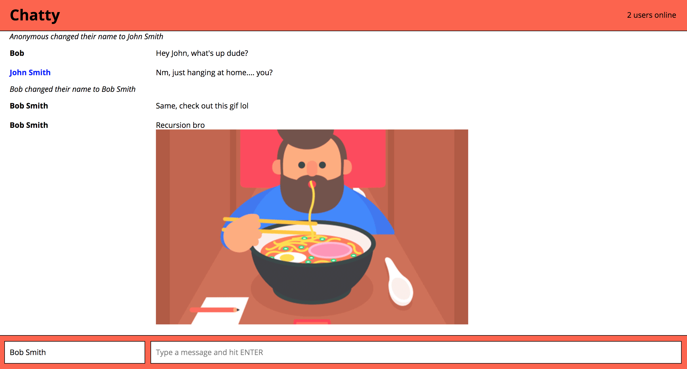
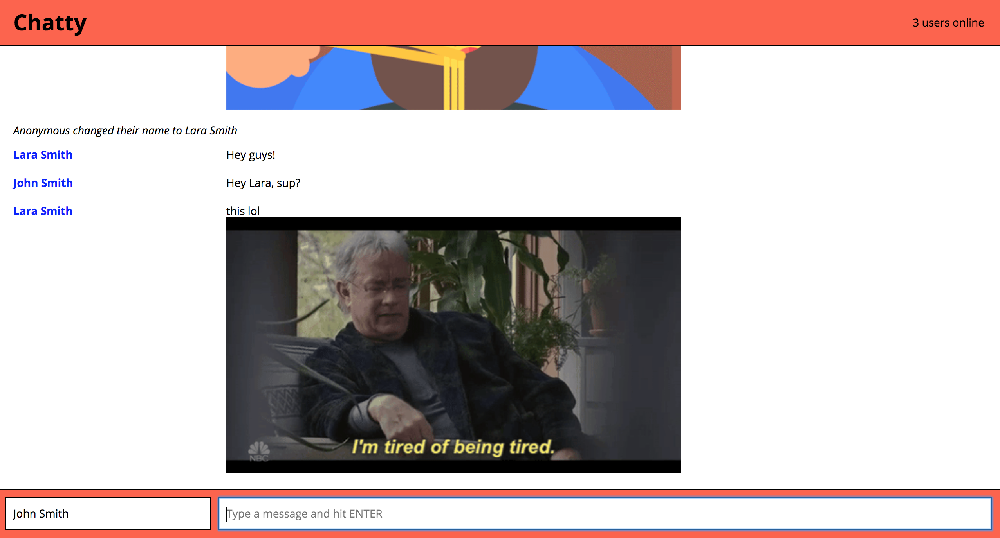

React Boilerplate
=====================

A minimal and light dev environment for ReactJS.

### Usage
Fork this repository, then clone your fork of this repository.

```
npm install
npm start
cd chatty_server
npm start
open http://localhost:3000
```

### Linting

This boilerplate project includes React ESLint configuration.

```
npm run lint
```

### Dependencies

* React
* Webpack
* [babel-loader](https://github.com/babel/babel-loader)
* [webpack-dev-server](https://github.com/webpack/webpack-dev-server)

## Final Product


